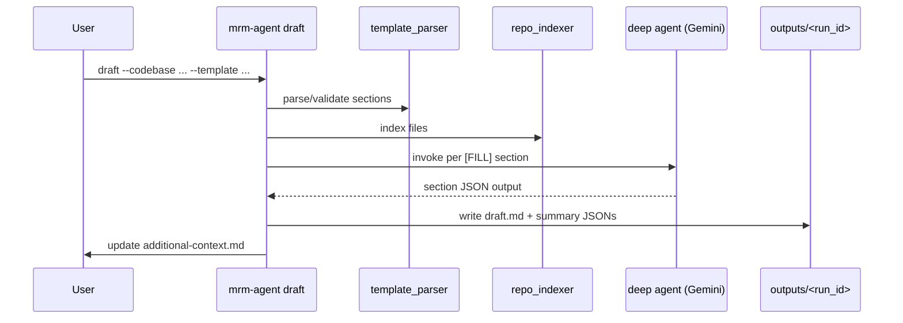
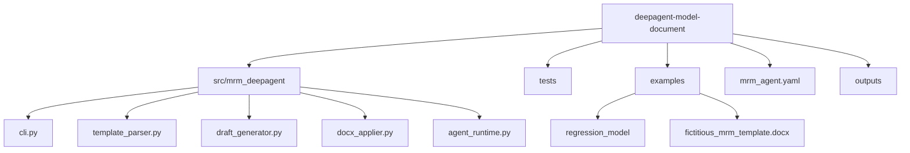

# MRM Deep Agent

CLI-first deep agent to draft and apply governance document updates from a codebase.

This project uses:

- LangChain `deepagents`
- Gemini via `langchain-google-genai`
- `uv` for Python environment and dependency management
- `ruff` for linting
- `pytest` + `pytest-cov` for tests and coverage

## What the agent does

1. Reads a governance template (`.docx` or `.md`) that can include:
- strict tags (`[FILL]`, `[SKIP]`, `[VALIDATOR]`, `[ID:...]`)
- imperfect/mixed tags
- untagged headings
- tables and checkbox tokens
2. Reads a model codebase and extracts evidence.
3. Generates a reviewable Markdown draft (`draft.md`) section by section.
4. Writes missing-information prompts to `additional-context.md`.
5. Applies reviewed draft content into a copy of the template.

## Architecture

```mermaid
graph TD
  A[Codebase] --> B[repo_indexer]
  T[Template (.docx/.md)] --> C[template_parser]
  X[additional-context.md] --> D[context_manager]
  B --> E[draft_generator]
  C --> E
  D --> E
  E --> F[agent_runtime + deepagents + Gemini]
  F --> G[draft.md]
  G --> H[draft_parser]
  T --> I[docx_applier]
  H --> I
  I --> J[applied-document.docx | applied-document.md]
```






## Prerequisites

- Python `3.11`
- `uv` installed (optional if you prefer classic `venv` + `pip`)
- Gemini API key auth configured for `draft`:
  - `GOOGLE_API_KEY` must be set in the environment

## Environment setup

### Option A: `uv` (recommended)

#### 1. Install dependencies

```bash
uv sync --all-groups
```

#### 2. Activate the environment (optional)

You can run everything with `uv run ...` without activating. If you prefer activation:

PowerShell:

```powershell
.venv\Scripts\Activate.ps1
```

Command Prompt:

```cmd
.venv\Scripts\activate.bat
```

macOS/Linux:

```bash
source .venv/bin/activate
```

#### 3. Verify install

```bash
uv run python --version
uv run ruff --version
uv run pytest --version
```

### Option B: classic `venv` + `pip` (no `uv`)

#### 1. Create and activate virtual environment

PowerShell:

```powershell
python -m venv .venv
.venv\Scripts\Activate.ps1
```

Command Prompt:

```cmd
python -m venv .venv
.venv\Scripts\activate.bat
```

macOS/Linux:

```bash
python3 -m venv .venv
source .venv/bin/activate
```

#### 2. Install package and dev dependencies

```bash
python -m pip install --upgrade pip
pip install -e .
pip install pytest pytest-cov pytest-mock ruff
```

#### 3. Verify install

```bash
python --version
python -m ruff --version
python -m pytest --version
```

## Authentication setup (API key)

Set your API key in the shell before running `draft`:

```bash
export GOOGLE_API_KEY=your_google_ai_studio_api_key_here
```

## Quick run

```bash
uv run mrm-agent validate-template --template examples/fictitious_mrm_template.docx
uv run mrm-agent draft --codebase examples/regression_model --template examples/fictitious_mrm_template.docx
# Review/edit outputs/<run_id>/draft.md and additional-context.md
uv run mrm-agent apply --draft outputs/<run_id>/draft.md --template examples/fictitious_mrm_template.docx
```

Markdown governance template example:

```bash
uv run mrm-agent validate-template --template examples/fictitious_governance_template.md
uv run mrm-agent draft --codebase examples/regression_model --template examples/fictitious_governance_template.md
uv run mrm-agent apply --draft outputs/<run_id>/draft.md --template examples/fictitious_governance_template.md
```

Classic `venv` + `pip` equivalent:

```bash
python -m mrm_deepagent.cli validate-template --template examples/fictitious_mrm_template.docx
python -m mrm_deepagent.cli draft --codebase examples/regression_model --template examples/fictitious_mrm_template.docx
# Review/edit outputs/<run_id>/draft.md and additional-context.md
python -m mrm_deepagent.cli apply --draft outputs/<run_id>/draft.md --template examples/fictitious_mrm_template.docx
```

## Command reference

### `validate-template`

Checks whether a `.docx` or `.md` template can be parsed into sections.

```bash
uv run mrm-agent validate-template --template examples/fictitious_mrm_template.docx
```

Verbosity control:

```bash
uv run mrm-agent validate-template --template examples/fictitious_mrm_template.docx --no-verbose
```

What it does:

- parses heading structure
- recognizes tagged and untagged section headings
- validates section IDs and fillable coverage

### `draft`

Generates a Markdown draft from template + codebase + context.

PowerShell:

```powershell
uv run mrm-agent draft `
  --codebase examples/regression_model `
  --template examples/fictitious_mrm_template.docx `
  --output-root outputs `
  --context-file additional-context.md `
  --model gemini-3-flash-preview `
  --section-retries 3 `
  --section-timeout-s 90
```

Bash/macOS/Linux:

```bash
uv run mrm-agent draft \
  --codebase examples/regression_model \
  --template examples/fictitious_mrm_template.docx \
  --output-root outputs \
  --context-file additional-context.md \
  --model gemini-3-flash-preview \
  --section-retries 3 \
  --section-timeout-s 90
```

Custom context file location example:

```powershell
uv run mrm-agent draft `
  --codebase examples/regression_model `
  --template examples/fictitious_mrm_template.docx `
  --context-file C:/work/mrm/context/model-a-context.md
```

Bash/macOS/Linux:

```bash
uv run mrm-agent draft \
  --codebase examples/regression_model \
  --template examples/fictitious_mrm_template.docx \
  --context-file C:/work/mrm/context/model-a-context.md
```

If `--context-file` is omitted, default path is:

- `contexts/<template-stem>-additional-context.md`

Use the same context path on later runs so the agent reuses your previous answers.

Verbosity control (verbose is on by default):

```bash
uv run mrm-agent draft ... --no-verbose
```

What it writes inside `outputs/<timestamp>/`:

- `draft.md`
- `draft-summary.json`
- `missing-items.json`
- `attachments-manifest.csv`
- `trace.json` (structured runtime trace for LLM/tool/run events)
- `trace.csv` (same trace in tabular form)

Trace fields include `event_type`, `component`, `action`, `status`, `section_id`, `attempt`,
`payload_format`, `duration_ms`, and `details`.

Also updates:

- context file (`--context-file` path or `contexts/<template-stem>-additional-context.md`)

### `apply`

Applies reviewed `draft.md` content into a copied template.

PowerShell:

```powershell
uv run mrm-agent apply `
  --draft outputs/<run_id>/draft.md `
  --template examples/fictitious_mrm_template.docx `
  --output-root outputs
```

Bash/macOS/Linux:

```bash
uv run mrm-agent apply \
  --draft outputs/<run_id>/draft.md \
  --template examples/fictitious_mrm_template.docx \
  --output-root outputs
```

Verbosity control:

```bash
uv run mrm-agent apply ... --no-verbose
```

Optional:

```bash
uv run mrm-agent apply ... --force
```

`--force` allows re-applying when the document already contains apply marker metadata.

Output filename depends on template format:

- DOCX template -> `applied-document.docx`
- Markdown template -> `applied-document.md`

## Execute without CLI wrapper script

If you do not want to use the installed `mrm-agent` command, run module form directly:

```bash
python -m mrm_deepagent.cli draft --codebase examples/regression_model --template examples/fictitious_mrm_template.docx
```

You can also drive the pipeline programmatically:

```python
from pathlib import Path

from mrm_deepagent.agent_runtime import build_agent
from mrm_deepagent.config import load_config
from mrm_deepagent.context_manager import load_context
from mrm_deepagent.draft_generator import build_tools, generate_draft, write_run_artifacts
from mrm_deepagent.repo_indexer import index_repo
from mrm_deepagent.template_parser import parse_template, validate_template

config = load_config()
template = parse_template(Path("examples/fictitious_mrm_template.docx"))
errors = validate_template(template)
if errors:
    raise RuntimeError(errors)

index = index_repo(
    codebase_path=Path("examples/regression_model"),
    allowlist=config.repo_allowlist,
    denylist=config.repo_denylist,
)
context = load_context(Path(config.context_file))
runtime = build_agent(config, build_tools(index, context))
draft = generate_draft(template, index, context, runtime)
write_run_artifacts(Path("outputs/manual-run"), draft)
```

## Template behavior and tokens

DOCX supported heading styles:

- `[FILL][ID:section_id] Title`
- `[ID:section_id][FILL] Title`
- `Title [FILL]`
- untagged headings (treated as fillable by default)
- `[SKIP]` and `[VALIDATOR]` headings remain protected from normal fill flow

Body/table tokens:

- `[[CHECK:name]]` gets replaced with checked/unchecked symbols during apply
- `[[SECTION_CONTENT]]` is preferred insertion point for generated narrative

Without `[[SECTION_CONTENT]]`, apply falls back to the first available section paragraph/cell.

Markdown template contract:

- Heading must include marker tags:
  - `[FILL][ID:<section_id>] <title>`
  - `[SKIP][ID:<section_id>] <title>`
  - `[VALIDATOR][ID:<section_id>] <title>`
- Fill sections must include `[[SECTION_CONTENT]]`.
- Optional checkbox tokens `[[CHECK:<name>]]` are supported.

## Configuration

Default config file: `mrm_agent.yaml`

Main fields:

- `model`
- `temperature`
- `max_section_tokens`
- `context_file`
- `output_root`
- `repo_allowlist`
- `repo_denylist`

## Example assets

- Fictitious model repo: `examples/regression_model/`
- Fictitious MRM template (DOCX): `examples/fictitious_mrm_template.docx`
- Fictitious governance template (Markdown): `examples/fictitious_governance_template.md`

Rebuild the sample template:

```bash
uv run python examples/build_fictitious_mrm_template.py
```

## Exit codes

- `0` success
- `2` invalid template markers/schema
- `3` missing required runtime config (for example `GOOGLE_API_KEY`)
- `4` invalid/unparseable draft markdown
- `5` unsupported/unsafe apply operation

## Verbose logging

All commands default to verbose logging (`--verbose`).

- Use `--no-verbose` to reduce output to essential success/error lines.
- Verbose lines are prefixed with `verbose:`.
- Draft mode logs per-section progress plus per-attempt LLM call diagnostics.

## Developer checks

```bash
uv run ruff check src tests examples
uv run pytest
```

## Notes

- Default context path is `contexts/<template-stem>-additional-context.md` unless overridden.
- `apply` never modifies the original input template path; it writes a copied output file.
