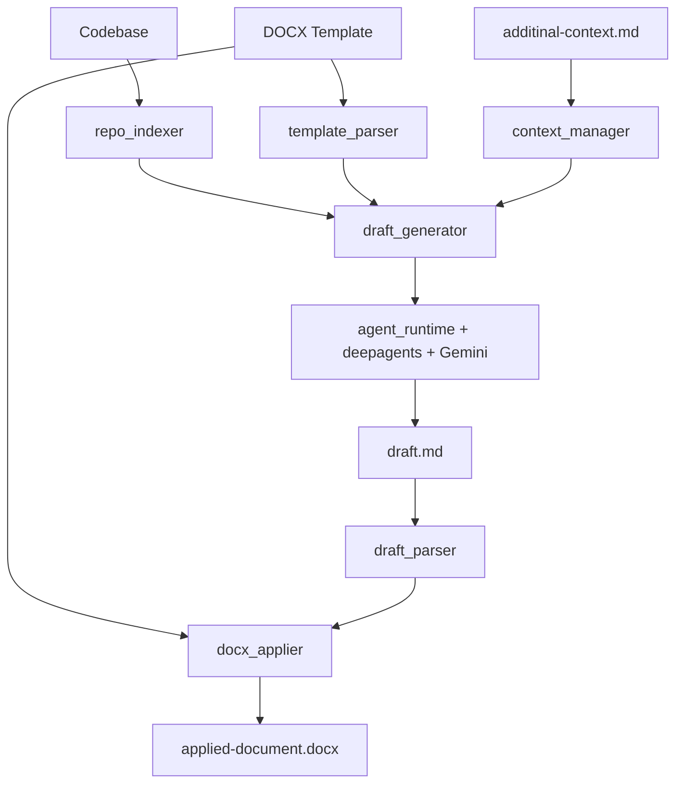
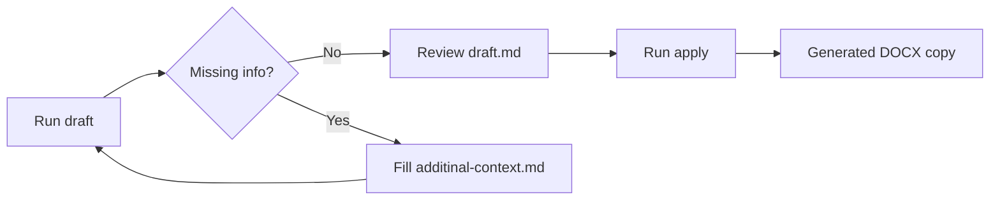
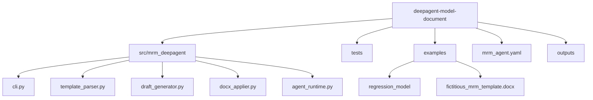

# MRM Deep Agent

CLI-first deep agent to draft and apply model risk management (MRM) document updates from a codebase.

This project uses:

- LangChain `deepagents`
- Gemini via `langchain-google-genai`
- `uv` for Python environment and dependency management
- `ruff` for linting
- `pytest` + `pytest-cov` for tests and coverage

## What the agent does

1. Reads a DOCX MRM template that can include:
- strict tags (`[FILL]`, `[SKIP]`, `[VALIDATOR]`, `[ID:...]`)
- imperfect/mixed tags
- untagged headings
- tables and checkbox tokens
2. Reads a model codebase and extracts evidence.
3. Generates a reviewable Markdown draft (`draft.md`) section by section.
4. Writes missing-information prompts to `additinal-context.md`.
5. Applies reviewed draft content into a copy of the DOCX template.

## Architecture








## Prerequisites

- Python `3.11`
- `uv` installed
- Gemini API key (`GOOGLE_API_KEY`) for `draft`

## Environment setup

### 1. Install dependencies

```bash
uv sync --all-groups
```

### 2. Activate the environment (optional)

You can run everything with `uv run ...` without activating. If you prefer activation:

PowerShell:

```powershell
.venv\Scripts\Activate.ps1
```

Command Prompt:

```cmd
.venv\Scripts\activate.bat
```

macOS/Linux:

```bash
source .venv/bin/activate
```

### 3. Verify install

```bash
uv run python --version
uv run ruff --version
uv run pytest --version
```

## API key setup

`draft` requires `GOOGLE_API_KEY` in the environment.

PowerShell (current terminal only):

```powershell
$env:GOOGLE_API_KEY="your_api_key_here"
```

PowerShell (persist for future terminals):

```powershell
setx GOOGLE_API_KEY "your_api_key_here"
```

macOS/Linux (current shell):

```bash
export GOOGLE_API_KEY="your_api_key_here"
```

macOS/Linux (persist):

Add to `~/.bashrc` or `~/.zshrc`:

```bash
export GOOGLE_API_KEY="your_api_key_here"
```

Then reload shell:

```bash
source ~/.bashrc
```

## Quick run

```bash
uv run mrm-agent validate-template --template examples/fictitious_mrm_template.docx
uv run mrm-agent draft --codebase examples/regression_model --template examples/fictitious_mrm_template.docx
# Review/edit outputs/<run_id>/draft.md and additinal-context.md
uv run mrm-agent apply --draft outputs/<run_id>/draft.md --template examples/fictitious_mrm_template.docx
```

## Command reference

### `validate-template`

Checks whether the template can be parsed into sections.

```bash
uv run mrm-agent validate-template --template <path.docx>
```

What it does:

- parses heading structure
- recognizes tagged and untagged section headings
- validates section IDs and fillable coverage

### `draft`

Generates a Markdown draft from template + codebase + context.

```bash
uv run mrm-agent draft \
  --codebase <path> \
  --template <path.docx> \
  --output-root outputs \
  --context-file additinal-context.md \
  --model gemini-3-flash-preview
```

What it writes inside `outputs/<timestamp>/`:

- `draft.md`
- `draft-summary.json`
- `missing-items.json`
- `attachments-manifest.csv`

Also updates:

- `additinal-context.md` (missing questions + preserved user responses)

### `apply`

Applies reviewed `draft.md` content into a copied DOCX template.

```bash
uv run mrm-agent apply \
  --draft <path/to/draft.md> \
  --template <path.docx> \
  --output-root outputs
```

Optional:

```bash
uv run mrm-agent apply ... --force
```

`--force` allows re-applying when the document already contains apply marker metadata.

## Template behavior and tokens

Supported heading styles:

- `[FILL][ID:section_id] Title`
- `[ID:section_id][FILL] Title`
- `Title [FILL]`
- untagged headings (treated as fillable by default)
- `[SKIP]` and `[VALIDATOR]` headings remain protected from normal fill flow

Body/table tokens:

- `[[CHECK:name]]` gets replaced with checked/unchecked symbols during apply
- `[[SECTION_CONTENT]]` is preferred insertion point for generated narrative

Without `[[SECTION_CONTENT]]`, apply falls back to the first available section paragraph/cell.

## Configuration

Default config file: `mrm_agent.yaml`

Main fields:

- `model`
- `fallback_model`
- `temperature`
- `max_section_tokens`
- `context_file`
- `output_root`
- `repo_allowlist`
- `repo_denylist`

## Example assets

- Fictitious model repo: `examples/regression_model/`
- Fictitious MRM template: `examples/fictitious_mrm_template.docx`

Rebuild the sample template:

```bash
uv run python examples/build_fictitious_mrm_template.py
```

## Exit codes

- `0` success
- `2` invalid template markers/schema
- `3` missing required runtime config (for example `GOOGLE_API_KEY`)
- `4` invalid/unparseable draft markdown
- `5` unsupported/unsafe apply operation

## Developer checks

```bash
uv run ruff check src tests examples
uv run pytest
```

## Notes

- The context filename is intentionally `additinal-context.md` (spelling preserved by project contract).
- `apply` never modifies the original input template path; it writes a copied output file.
